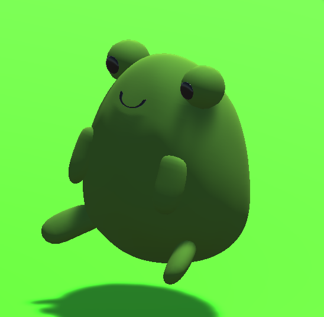
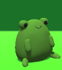
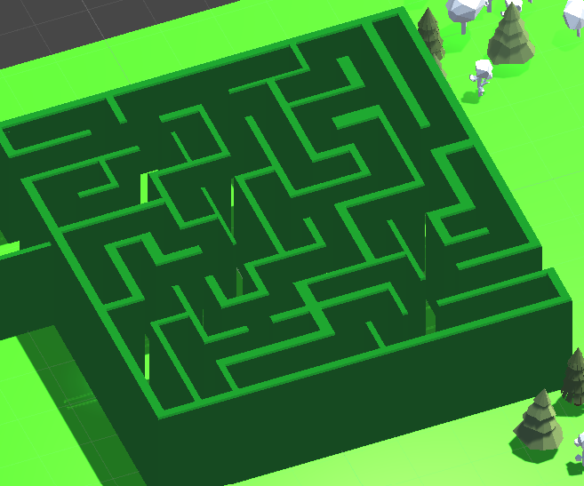
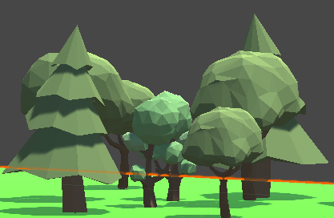
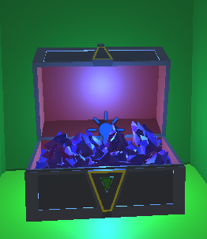
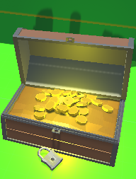
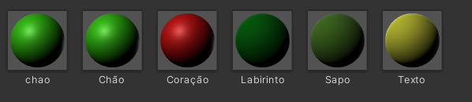
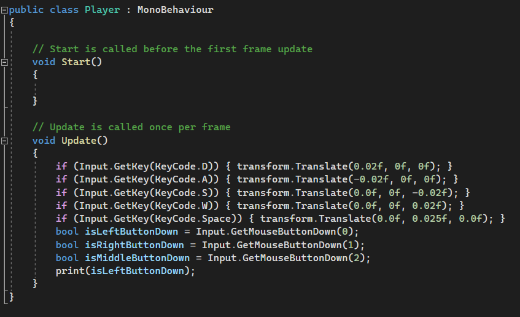
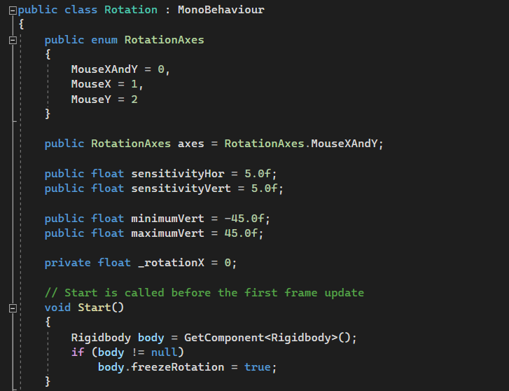

# AtividadeCena
Cauã Magalhães e Gustavo Henrique

# Link para o drive

https://drive.google.com/file/d/1MVlsc42ZZATcAwbOPxDe2zNz_yRgz8G8/view?usp=sharing

# Descrição

Está e uma cena no Unity 3d, onde o objetivo é passar de um labirinto, e encontrar o final para uma recompensa.

# Cena

Para a criação desta cena, foram utilizados GameObjects , assests gratuitos da Unity store, Objetos e personagem modelados no blender.

# GameObjects

<h1>Feitos no blender.</h1>

Sapos. 

  

Labirinto. 
 

Textos. 

  
 

<h1>Assets</h1>

Natureza. 

Báus. 

 

<h1>Feitos no Unity</h1>
Luzes utilizadas: Directional Light, e 2 Point Lights para os Báus. 
Camera, para seguir o personagem. 
Materiais. 

Coração: foram utilizados dois 3D Objects de "Capsule" 

Paredes do fim, e chão foram feitos com cubos
 

# Script

<h1>Movimento</h1> 

Este código é para movimentar o personagem, no caso o "Sapo". Ele permite que o personagem se mova pelas teclas do teclado (W, A, S, D). A função "transform.Translate" é usada para realizar o movimento do personagem no espaço. A linha "print(isLeftButtonDown)" imprime no console se o botão esquerdo do mouse está sendo pressionado ou não.

<h1>Rotação</h1> 

Este código controla a rotação do personagem usando o movimento do mouse. Dependendo do valor da variável "axes", ele rotaciona o objeto nos eixos X e Y. Os valores de movimento do mouse são obtidos com "Input.GetAxis" e a rotação é aplicada usando as funções "transform.Rotate" e "transform.localEulerAngles".
